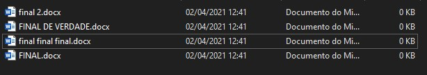
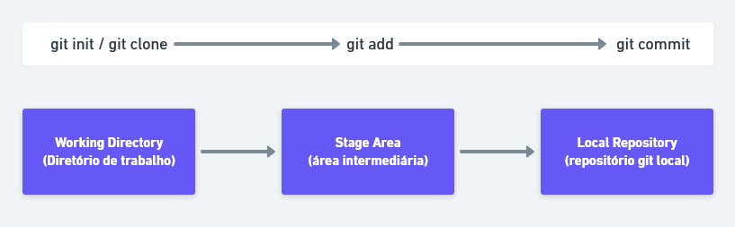
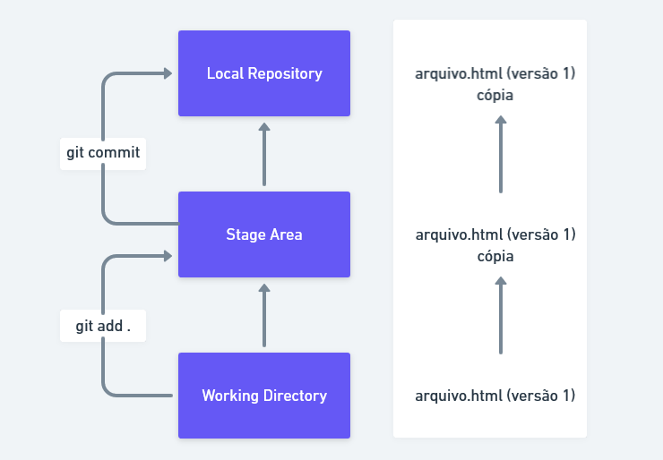
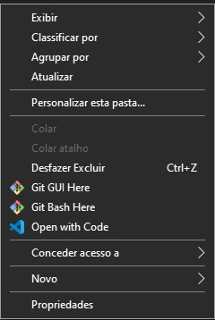
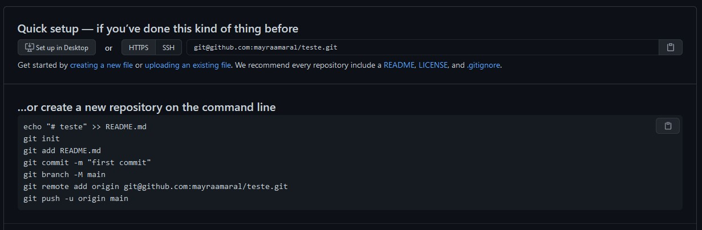

# Mini guia de Git e Github
Um mini guia de Git e Github em PT-BR para aqueles que estão iniciando os estudos.  
  
Antes de qualquer coisa, é válido ressaltar que o Git possui [uma documentação](https://git-scm.com/book/pt-br/v2/Come%C3%A7ando-O-B%C3%A1sico-do-Git) em Português muito boa e sólida e que pode servir como auxílio no aprendizado. Do mesmo modo, o Github também possui [documentação](https://docs.github.com/pt/github) em Português ~~(um pouco bagunçada)~~ que pode servir como fonte de consulta.  
  
## Sumário
  
* [0. Getting Started](https://github.com/mayraamaral/guia-de-git#0-getting-started)
* [1. Por que usar o Git?](https://github.com/mayraamaral/guia-de-git#1-por-que-usar-o-git)
* [2. O que é o Git?](https://github.com/mayraamaral/guia-de-git#2-o-que-%C3%A9-o-git)
* [2.1 Como funciona?](https://github.com/mayraamaral/guia-de-git#21-como-funciona)
* [3. Configurando](https://github.com/mayraamaral/guia-de-git#3-configurando)
* [4. Iniciando](https://github.com/mayraamaral/guia-de-git#4-come%C3%A7ando)
* [5. Github e SSH](https://github.com/mayraamaral/guia-de-git#5-github-e-ssh)
* [6. Vamos então criar um repositório!](https://github.com/mayraamaral/guia-de-git#6-vamos-ent%C3%A3o-criar-um-reposit%C3%B3rio)
* [7. Conclusão e créditos](https://github.com/mayraamaral/guia-de-git#7-conclus%C3%A3o-e-cr%C3%A9ditos)
  

## 0. Começando
Lembra de quando você foi escrever um trabalho importante no Work (ou qualquer outro editor de texto) e criou dez versões "finais"?  
  
<p align="center"></p>
  

Bom, se isso nunca aconteceu com você... Você tem sorte, porque gerenciar diferentes versões de arquivos pode ser um pouco trabalhoso. O Git surge como uma forma mais fácil de fazer esse gerenciamento, evitando todo o estresse.  
  
## 1. Por que usar o Git?
* Você pode modificar um arquivo, sem perder o que tinha antes;
* Você pode ter acesso a todas as modificações feitas no arquivo;
* Você pode desenvolver com outra pessoa (ou mais pessoas);
* Você pode resgatar uma versão anterior de um arquivo (ou código);
* E a lista continua...

## 2. O que é o Git?
Ao pé da letra, o Git é um VCS - *Version Control System*, um sistema de controle de versões. Ou seja, ele facilita o problema que foi citado no tópico [0. Começando]() deste tutorial.  
Se você quiser resgatar uma versão anterior de um código seu, é possível. Se você quiser desenvolver com mais pessoas, é possível também. Isso acontece porque além de **criar uma cópia do diretório trabalhado no seu PC**, você também pode fazer uso de sistemas de gerenciamento de código online, como o [Github](https://github.com). É válido ressaltar que também existem outras alternativas, como Gitlab e Bitbucket. Mas, atualmente, o mais famoso é o Github.

## 2.1 Como funciona?

<p align="center"></p>
  
Existem três conceitos que são necessários quando estamos estudando Git, principalmente esses três conceitos: **Working directory**, **Stage area** e **Local repository**.  
  
Antes de qualquer coisa, irei explicar de uma forma mais leiga e didática para que seja mais fácil compreender.  
  
* **Working directory** é o diretório de trabalho na tradução literal e seu significado fica bem próximo dessa tradução. O working directory é, nada mais, do que o diretório em que você está trabalhando, fazendo alterações e modificações. No Git, isso também significa que essas alterações e modificações **não foram** enviadas ao Git.
  
* **Stage area** é a área em que você está preparando os arquivos para serem "enviados" ao Git, é como um limbo. É uma área que vai servir de intermédio entre o seu diretório de trabalho e o diretório do Git.
  
* **Local repository** é o repositório local do Git, ou seja, ele fica na sua máquina. Nele está contido o clone do seu projeto, clone esse que foi feito pelo Git e que guarda o log (histórico) de alterações feitas. É como se fosse um backup, melhor dizendo.  
  
Para "navegar" entre esses três conceitos que acabamos de entender, usamos dois comandos no Git. Antes de mais nada, saiba que sempre que você inicia, está no **working repository**, para enviar seus arquivos para a **stage area**, use o comando  
```git add .```  
  
Você pode colocar esse ponto final ( . ) no fim do git add para sinalizar que todos os arquivos do diretório devem ser considerados, mas, caso prefira, pode digitar cada um dos arquivos individualmente, por exemplo:  
```
git add index.html
git add style.css
``` 
  
As duas formas funcionam, porém o ```git add .``` é mais conciso e evita digitar tanto código (imagine ter que adicionar manualmente um diretório com mais de...300 arquivos? Inviável, né?!)  
  
Segue uma imagem para ilustrar o que acabamos de compreender:  

<p align="center"></p>
  
Falamos do ```git add .```, agora precisamos falar do famoso **commit**! Com o commit você está "enviando" seus arquivos para o repositório do Git (local repository), que fica na sua máquina e está, assim, garantindo que todas as versões sejam armazenadas.  
Para usar o commit, basta escrever ```git commit -m "nome do commit"```. Em "nome do commit", você deve colocar a alteração que foi feita. Ah, normalmente os verbos no Git são usados no impessoal, por exemplo "altera index", "modifica imagens", etc...  
  
## 3. Configurando
1. Entre no [site do Git](https://git-scm.com/) e faça download do arquivo de acordo com seu sistema operacional (em caso de Mac ou Linux, é possível que já venha instalado no seu computador, caso contrário, instale via terminal);
2. Vamos agora configurar seu nome e e-mail. Use os comandos abaixo com as devidas modificações:  
  
  
```
git config --global user.name "Seu Nome Aqui"
git config --global user.email "seuemail@aqui.com"
```
  
Caso queira listar e visualizar as configurações recém definidas, basta usar o comando:  
  
```git config --list```  
  
## 4. Começando
Agora vamos finalmente começar!  
O primeiro passo é criar uma pasta no seu computador. 
  
Caso esteja no **Linux ou Mac** basta usar os códigos abaixo:  
  
```mkdir nomeDaPasta```  
  
Caso você esteja no **Windows**, o processo é um pouco diferente. Crie uma pasta pelo Explorer (o gerenciador de arquivos do Windows) e, **dentro da pasta** clique com o botão direito do mouse, deve abrir essa janela:  
  
<p align="center"></p>  
  
Clique em "Git Bash Here", isso irá abrir o terminal do Git especificamente nessa pasta e você então poderá escrever os comandos Git!  
  
Após isso, inicie o repositório Git:  
  
```git init```  
Pronto! Você tem um repositório local do Git funcionando na sua máquina. Agora crie um arquivo qualquer.  
  
Vamos adicionar esse arquivo (mandar pra stage area): ```git add .```
  
Depois é só *commitar* e então ok!  
  
```git commit -m "adiciona esse arquivo no local repository```
  
  
## 5. Github e SSH
Essa parte pode ser um pouco complexa para muitos, então **preste bastante atenção**.  
  
O primeiro passo, obviamente, é criar uma conta no Github, mas se você está lendo isso, suponho que já tenha uma, então vamos pular essa etapa. Agora vamos criar uma chave SSH. Essa chave vai permitir a "comunicação" entre seu computador e o servidor do Github, pois assim você irá conseguir enviar seus arquivos para o servidor remoto de maneira segura e rápida.

* [Instalação no Windows](https://github.com/mayraamaral/guia-de-git#se-voc%C3%AA-est%C3%A1-no-windows)
* [Instalação no Linux](https://github.com/mayraamaral/guia-de-git#se-voc%C3%AA-tem-linux)
* [Instalação no Mac](https://github.com/mayraamaral/guia-de-git#se-voc%C3%AA-tem-mac)
  
### Se você está no Windows
  
Abra o terminal do Git, o Git Bash e digite:    
```
ssh-keygen -t rsa -b 4096 -C "seuemail@aqui.com"
```
Mude o "seuemail @aqui.com" para o seu e-mail do Github (o e-mail com o qual você cadastrou a sua conta).  
  
Basta pressionar **enter** nos campos que forem aparecendo. 
  
Agora que a chave SSH foi criada, precisamos adicioná-la ao SSH Agent, que gerencia as chaves SSH.  
  
```
eval `ssh-agent -s
```

Depois adicione sua chave privada ao SSH Agent.  
  
```
ssh-add ~/.ssh/id_rsa
```  
  
Pronto! Agora tudo o que precisamos fazer é adicionar a sua chave SSH pública ao Github, permitindo assim que o Git da sua máquina "se comunique" com o Github e mande seus repositórios para os servidores remotos do Git.  
  
Você deve copiar o código da sua chave SSH pública primeiro. Para isso, digite no Git Bash:  
  
```
clip ~/.ssh/id_rsa.pub
```
  
Depois vá ao Github, em **Settings** e clique em **Chaves SSH e GPG**. Crie uma nova chave SSH (no Github) clicando em **New SSH key** e cole sua chave no campo **Key**. 
  
Ufa! Pronto! Você já pode enviar seus diretórios para o Github!  
  
### Se você tem Linux

Instale o xclip via terminal para copiar sua chave de SSH pública:  
``` 
sudo apt-get install xclip
```  
Agora copie sua chave, para depois colar no Github:  
```
xclip -selection clipboard < ~/.ssh/id_rsa.pub
```` 
O processo, nesse momento, é idêntico ao feito no Windows. Vá ao Github, em **Settings** e clique em **Chaves SSH e GPG**. Crie uma nova chave SSH (no Github) clicando em **New SSH key** e cole sua chave no campo **Key**. 
  
Pronto! Seu Linux está preparado para usar o Github, enviando seus repositórios locais para o servidores remotos.  
  
### Se você tem Mac
  
Para copiar sua chave SSH, digite no terminal:
  
```
pbcopy < ~/.ssh/id_rsa.pub
```  
  
O processo, nesse momento, é idêntico ao feito no Windows e no Linux. Vá ao Github, em **Settings** e clique em **Chaves SSH e GPG**. Crie uma nova chave SSH (no Github) clicando em **New SSH key** e cole sua chave no campo **Key**. Irá aparecer uma janela para inserir sua senha, insira e após isso, clique em confirmar.
  
Pronto! Seu Mac está preparado para usar o Github, enviando seus repositórios locais para o servidores remotos.  
  
## 6. Vamos então criar um repositório
Ao abrir o Github, clique em New. Deixe as outras caixas sem marcar, não crie um arquivo README ainda. Vamos fazer isso manualmente pelo terminal depois. 
  
Depois de ter criado o repositório **vazio**, essa página deve ter aparecido:  

<p align="center"></p>  

Copie o código ```git@github.com:nomedeusuario/repositorio.git``` que aparece.  
  
Crie a pasta que irá servir de repositório e acesse o terminal (ou o Git Bash) dentro dessa pasta.  
  
Digite o ```git init``` para iniciar o repositório Git local.  
  

Agora digite o código abaixo, colocando o "link" SSH que você copiou do Github.  
  
```
git remote add origin git@github.com:nomedeusuario/repositorio.git
``` 
  
Fazendo isso estamos linkando nosso repositório local com o repositório remoto do Github.  
  
Crie a *branch* main, para poder trabalhar em cima dela. Imagine uma branch como sendo um quarto dentro de uma casa, ou uma mesa. Ela vai te possibilitar modificar seus arquivos e fazer alterações. Falaremos disso depois.  
Para criar a branch, digite:  
  
```
git checkout -b main
```  
  
Vamos criar um arquivo README como exemplo, e enviá-lo ao Github.  
  
Para criar, digite no terminal (tanto Windows, quanto Linux, quanto Mac):  

```
touch README.md
```  

Agora vamos enviar esse arquivo para a **stage area**, digite:  
  
```
git add .
``` 

Agora vamos enviar para o repositório local:  
  
```
git commit -m "adiciona README"
```  
  
E, finalmente, vamos enviar esse arquivo para o Github:  
  
```
git push origin main
```  
  
Pronto! Você tem um repositório local (no seu computador) e remoto (no Github) em perfeita comunicação. Bem vindo(a/e) ao mundo do Git!  
  
## 7. Conclusão e créditos
Esse repositório foi feito para auxiliar uma amiga nos estudos de Git e, eu pensei que poderia ajudar a mais pessoas, por isso está disponível aqui gratuitamente.  
  
Não está perfeito, e está longe de estar completo. Existem muitas funcionalidades no Git que eu não abordei aqui, seja por falta de tempo, seja para não me estender demais.  
  
Sinta-se à vontade para evoluir o conteúdo disponível aqui, através de um Pull-Request. Será muito bem vindo.  
  
Esse texto foi **inteiramente** desenvolvido por mim, eu usei como fonte de consulta os próprios sites do Git e do Github, que estão listados no início deste artigo.  
  
Espero que tenha sido útil!